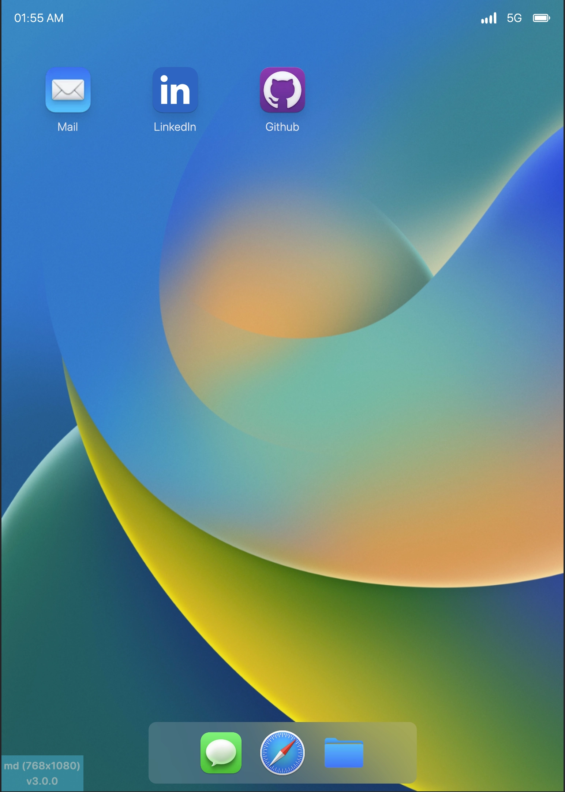
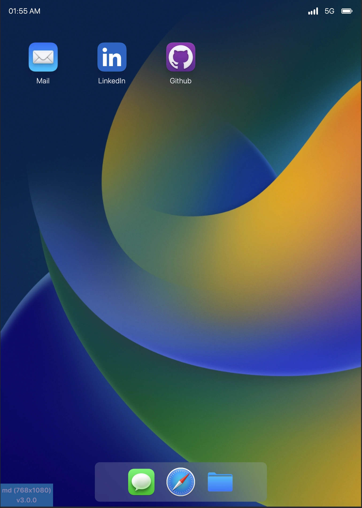

# portfolio-os

This repository contains README file for [Portfolio website](https://www.alicandirik.com) which is responsive MacOS/IOS GUI powered by [VueJS](https://v3.vuejs.org/), [Vuex](https://vuex.vuejs.org/), [SCSS](https://sass-lang.com/) and [Firebase](https://firebase.google.com/)

|                       Light Theme                       |                        Dark Theme                         |
|:-------------------------------------------------------:|:---------------------------------------------------------:|
|                              |                            |
|  |  |
